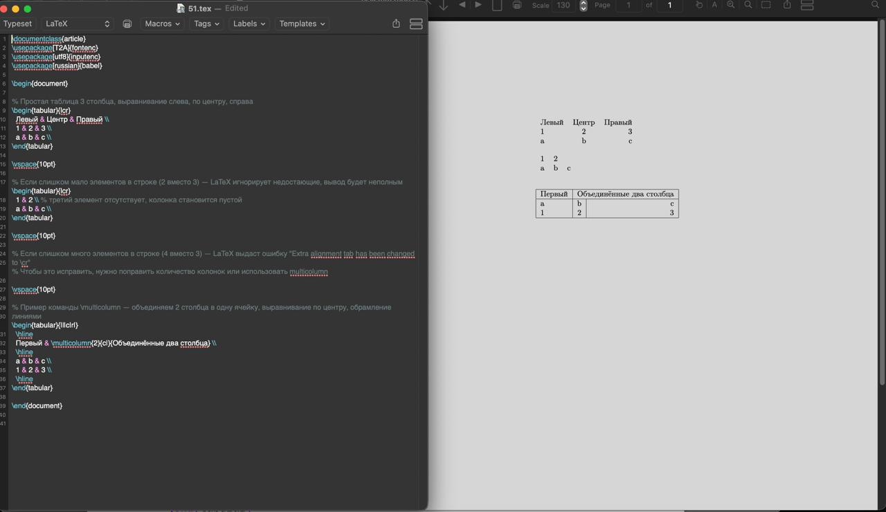

***Савченко Елизавета Николаевна, НПИмд-01-24, 1132249569***
**Российский университет дружбы народов, Москва, Россия**

8 ноября 2025

# Общая информация о лабораторной работе

## Теоретическая часть

Таблицы — один из важнейших элементов оформления документов, позволяющий структурировать и наглядно представлять данные. В LaTeX форматирование таблиц выполняется с помощью окружения tabular, в котором указывается количество и выравнивание столбцов.

- Выравнивания столбцов:

- l (left) — выравнивание по левому краю,
- c (center) — по центру,
- r (right) — по правому краю.

Правильный выбор выравнивания улучшает читаемость информации, особенно числовых и текстовых данных.

- Количество элементов в строке:

При создании таблицы каждая строка должна содержать ровно столько элементов, сколько столбцов указано в параметрах окружения tabular.

- Если в строке меньше элементов, LaTeX оставит отсутствующие ячейки пустыми, что может привести к "недозаполненной" таблице.
- Если элементов больше, то возникнет ошибка "Extra alignment tab has been changed to \cr", так как LaTeX не сможет корректно распределить их по столбцам.

- Объединение столбцов через \multicolumn:

Эта команда используется для объединения нескольких соседних столбцов в одну ячейку. Формат:
\multicolumn{N}{alignment}{content}, где N — число объединяемых столбцов, alignment — выравнивание объединённой ячейки, content — её содержимое.
Это удобно для создания заголовков, выделения важных данных, повышения читабельности таблиц.

- Оформление таблиц:

Использование линий (|) и команд вроде \hline помогает отделять ячейки и визуально структурировать информацию, делая таблицу более аккуратной и понятной.

## Цель работы

Научиться создавать и оформлять таблицы, контролировать выравнивание столбцов и использовать объединение нескольких столбцов для улучшения визуального представления данных.

## Задание

- Использовать простой пример таблицы, чтобы начать экспериментировать с таблицами.
- Попробовать разные выравнивания столбцов с помощью типов l (влево), c (по центру) и r (вправо).
- Что происходит, если в строке таблицы слишком мало элементов?
- А если слишком много?
- Поэкспериментируйте с командой \multicolumn, чтобы объединять несколько столбцов.

# Выполнение лабораторной работы 

## Код программы.

    \documentclass{article}
    \usepackage[T2A]{fontenc}
    \usepackage[utf8]{inputenc}
    \usepackage[russian]{babel}
    
    \begin{document}
    
    % Простая таблица 3 столбца, выравнивание слева, по центру, справа
    \begin{tabular}{lcr}
      Левый & Центр & Правый \\
      1 & 2 & 3 \\
      a & b & c \\
    \end{tabular}
    
    \vspace{10pt}
    
    % Если слишком мало элементов в строке (2 вместо 3) — LaTeX игнорирует недостающие, вывод будет неполным
    \begin{tabular}{lcr}
      1 & 2 \\ % третий элемент отсутствует, колонка становится пустой
      a & b & c \\
    \end{tabular}
    
    \vspace{10pt}
    
    % Если слишком много элементов в строке (4 вместо 3) — LaTeX выдаст ошибку "Extra alignment tab has been changed to \cr"
    % Чтобы это исправить, нужно поправить количество колонок или использовать multicolumn
    
    \vspace{10pt}
    
    % Пример команды \multicolumn — объединяем 2 столбца в одну ячейку, выравнивание по центру, обрамление линиями
    \begin{tabular}{|l|c|r|}
      \hline
      Первый & \multicolumn{2}{c|}{Объединённые два столбца} \\
      \hline
      a & b & c \\
      1 & 2 & 3 \\
      \hline
    \end{tabular}
    
    \end{document}

## Ответ программы

# Выводы

Эксперименты показали, что разные типы выравнивания влияют на внешний вид таблицы. При недостатке элементов в строке таблица может выглядеть неполной, а при избытке — нарушается структура и оформление. Использование команды \multicolumn позволяет объединять несколько ячеек по горизонтали, что помогает создавать более сложные и аккуратные таблицы.