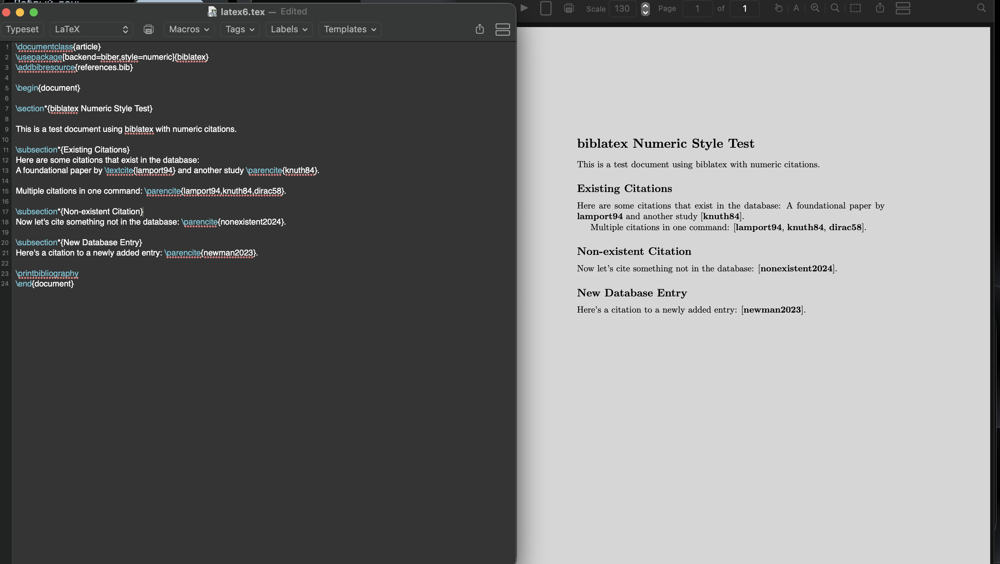

---
## Front matter
title: "Отчёт по лабораторной работе №6"
subtitle: "Дисциплина: Computer Skills for Scientific Writing"
author: "Савченко Елизавета Николаевна"

## Generic otions
lang: ru-RU
toc-title: "Содержание"

## Bibliography
bibliography: bib/cite.bib
csl: pandoc/csl/gost-r-7-0-5-2008-numeric.csl

## Pdf output format
toc: true # Table of contents
toc-depth: 2
lof: true # List of figures
lot: false # List of tables
fontsize: 12pt
linestretch: 1.5
papersize: a4
documentclass: scrreprt
## I18n polyglossia
polyglossia-lang:
  name: russian
  options:
	- spelling=modern
	- babelshorthands=true
polyglossia-otherlangs:
  name: english
## I18n babel
babel-lang: russian
babel-otherlangs: english
## Fonts
mainfont: IBM Plex Serif
romanfont: IBM Plex Serif
sansfont: IBM Plex Sans
monofont: IBM Plex Mono
mathfont: STIX Two Math
mainfontoptions: Ligatures=Common,Ligatures=TeX,Scale=0.94
romanfontoptions: Ligatures=Common,Ligatures=TeX,Scale=0.94
sansfontoptions: Ligatures=Common,Ligatures=TeX,Scale=MatchLowercase,Scale=0.94
monofontoptions: Scale=MatchLowercase,Scale=0.94,FakeStretch=0.9
mathfontoptions:
## Biblatex
biblatex: true
biblio-style: "gost-numeric"
biblatexoptions:
  - parentracker=true
  - backend=biber
  - hyperref=auto
  - language=auto
  - autolang=other*
  - citestyle=gost-numeric
## Pandoc-crossref LaTeX customization
figureTitle: "Рис."
tableTitle: "Таблица"
listingTitle: "Листинг"
lofTitle: "Список иллюстраций"
lotTitle: "Список таблиц"
lolTitle: "Листинги"
## Misc options
indent: true
header-includes:
  - \usepackage{indentfirst}
  - \usepackage{float} # keep figures where there are in the text
  - \floatplacement{figure}{H} # keep figures where there are in the text
---

# Общая информация о задании лабораторной работы

## Цель работы

Изучение основ форматирования текста в LaTeX, включая работу с пробелами, абзацами, специальными символами

## Задание

1. Создание базового документа

- Создать документ с различными типами абзацев
- исследовать автоматическое форматирование абзацев в LaTeX

2. Работа с пробелами

- Обычные пробелы latex
Это    предложение    с    множественными    пробелами
Результат: LaTeX автоматически преобразует множественные пробелы в один.

- Жёсткие пробелы (Non-breaking spaces)
latex
Глава~1, Раздел~2, Рисунок~3, г.~Москва
Результат: Слова не разрываются при переносе строки.

- Неразрывные дефисы
latex
10--20~лет, Москва--Санкт-Петербург

3. Специальные символы и форматирование

- Экранирование специальных символов
latex
\# \$ \% \& \{ \} \_ \textbackslash

- Форматирование текста

Жирный текст: \textbf{...}
Курсив: \textit{...}
Моноширинный: \texttt{...}
Малые прописные: \textsc{...}

- Размеры шрифта

latex
{\tiny текст} {\small текст} {\large текст} {\huge текст}

4. Эксперименты с пробелами

Горизонтальные пробелы

latex
Слово1 \hspace{2cm} Слово2
Слово3 \hfill Слово4
Вертикальные пробелы

latex
Текст перед пробелом
\vspace{1cm}
Текст после пробела

5. Межстрочный интервал

Использование пакета setspace:

# Выполнение лабораторной работы 

## Код программы.

    \documentclass{article}
    \usepackage[backend=biber,style=numeric]{biblatex}
    \addbibresource{references.bib}
    
    \begin{document}
    
    \section*{biblatex Numeric Style Test}
    
    This is a test document using biblatex with numeric citations.
    
    \subsection*{Existing Citations}
    Here are some citations that exist in the database: 
    A foundational paper by \textcite{lamport94} and another study \parencite{knuth84}.
    
    Multiple citations in one command: \parencite{lamport94,knuth84,dirac58}.
    
    \subsection*{Non-existent Citation}
    Now let's cite something not in the database: \parencite{nonexistent2024}.
    
    \subsection*{New Database Entry}
    Here's a citation to a newly added entry: \parencite{newman2023}.
    
    \printbibliography
    \end{document}
    
## Ответ программы

# Выводы

1. LaTeX автоматически обрабатывает пробелы и форматирование текста 
2. Жёсткие пробелы необходимы для предотвращения нежелательных разрывов строк 
3. Специальные символы требуют экранирования 
4. Редакторы предоставляют удобные инструменты для работы с кодом и просмотра результата 
5. Система LaTeX обеспечивает профессиональное оформление документов при минимальных усилиях