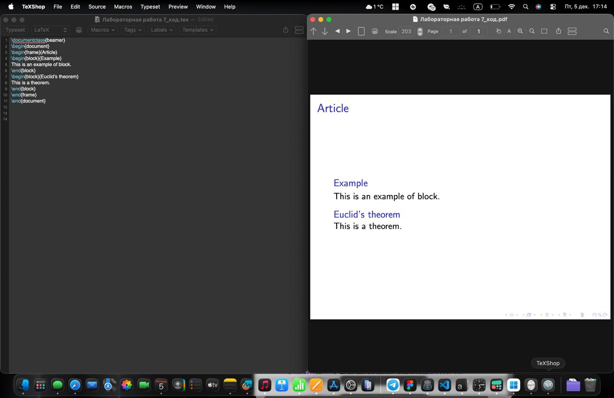
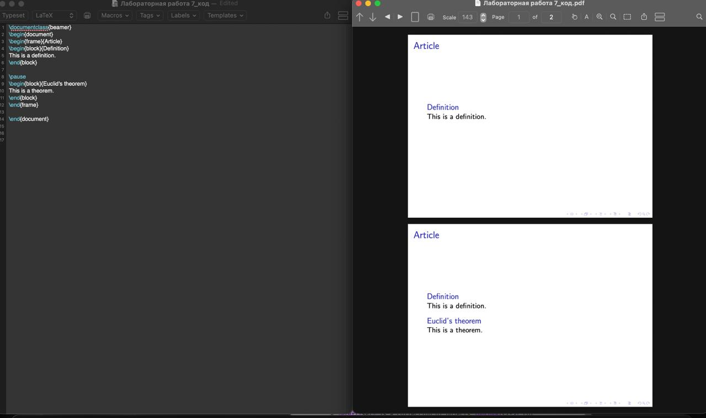
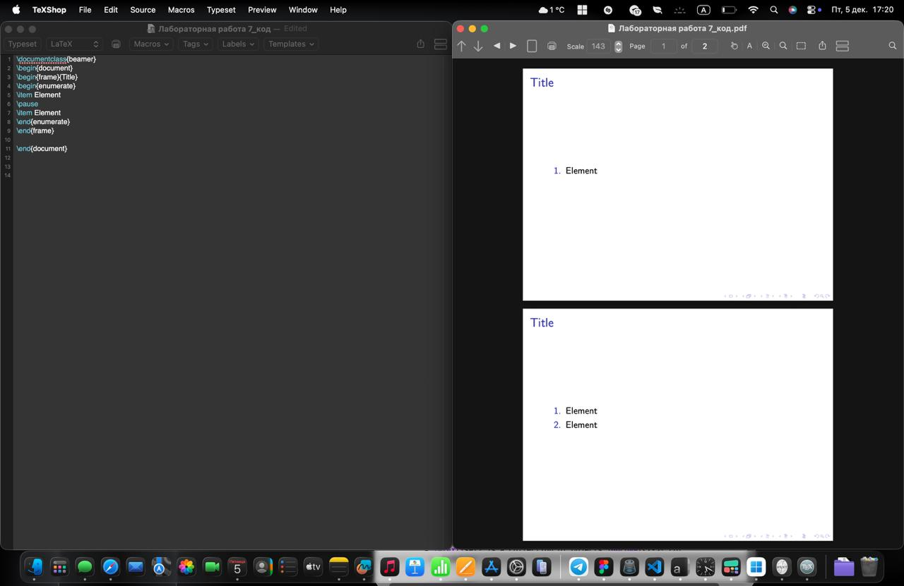
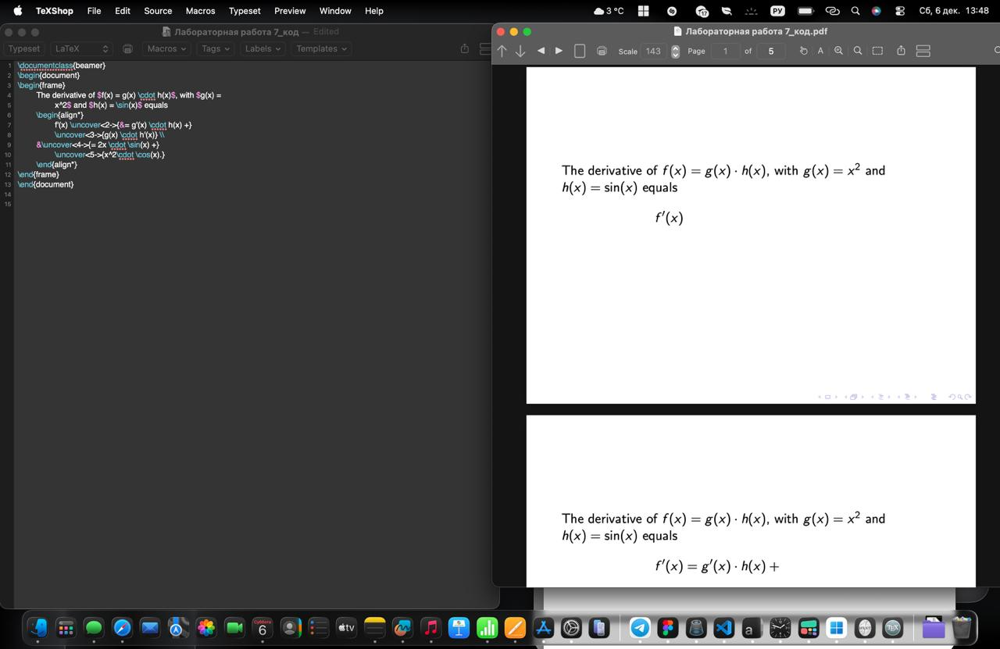

---
## Front matter
lang: ru-RU
title: Практикум по научному письму
author: Савченко Елизавета Николаевна
institute: РУДН, Москва, Россия

date: 6 декабря 2025

## Formatting
## i18n babel
babel-lang: russian
babel-otherlangs: english

## Formatting pdf
toc: false
toc-title: Содержание
slide_level: 2
aspectratio: 169
section-titles: true
theme: metropolis
header-includes:
 - \metroset{progressbar=frametitle,sectionpage=progressbar,numbering=fraction}

---

# Лабораторная работа 7

## Класс документа beamer

## Слайд

## Команда pause
## Команда uncover

## Постер

## Выводы

- Познакомилася с LaTeX
- Изучила новый пакет
- Научилася работе с презентациями

## {.standout}

Спасибо за внимание!
